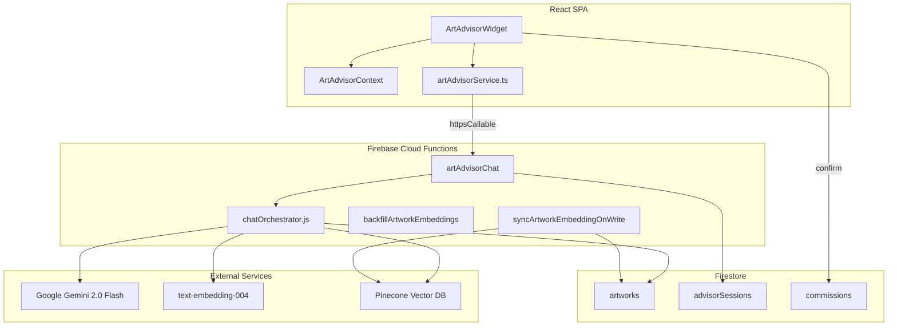

# AI Art Advisor Integration

Kalarang's **AI Art Advisor** is a buyer-facing chatbot that helps users discover artworks from the catalog and post custom commission requests through natural conversation — instead of filling out long forms.

---

## Overview

| Capability | Description |
|---|---|
| **Art discovery** | Buyer describes what they want; the bot asks clarifying questions one at a time, then searches the catalog and recommends matching artworks. |
| **Commission assistant** | Buyer says they want custom art; the bot collects requirements conversationally and creates a commission draft for confirmation. |
| **RAG search** | Artworks are embedded into Pinecone; semantic search finds relevant pieces even when the buyer's words don't match titles exactly. |

The widget appears as a floating teal robot button (bottom-right) for **logged-in buyers only**. It is portaled to `document.body` so it is not clipped by layout overflow.

---

## Architecture



### Data flow (single chat turn)

1. Buyer sends a message from the widget.
2. Frontend calls `artAdvisorChat` with `sessionId`, `message`, and optional reference image URLs.
3. Backend loads or creates a session in `advisorSessions`.
4. Gemini receives conversation history + system prompt and may call tools:
   - `search_artworks` — embed query → Pinecone search → hydrate from Firestore
   - `update_commission_draft` — merge fields into session draft
   - `mark_commission_ready` — validate draft → return summary for confirmation
   - `recommend_artists` — query artists by style
5. Backend saves updated messages and draft, returns reply + recommendations.
6. Frontend renders the reply; if the AI lists options, quick-reply buttons appear automatically.

---

## User Flows

### Art discovery

The AI asks **one question at a time**:

1. What kind of art? (style, mood, room)
2. Preferred size? (Small / Medium / Large)
3. Budget range?
4. Color, theme, or medium preferences?

After 2–3 answers, it calls `search_artworks` and shows clickable artwork cards. Tapping a card opens `/card/:id`.

### Commission request

The AI collects fields **one at a time**, mirroring the manual commission form:

1. Subject (title + description)
2. Type — Digital, Painting, or Sketch
3. Style
4. Size — A4, A3, A2, or custom
5. Budget
6. Deadline
7. City / pincode
8. Reference images (optional)

When all required fields are valid, the bot shows a **Commission Summary** card. The buyer confirms → frontend calls existing `createCommissionRequest()` → navigates to `/commissions`.

---

## Tech Stack

| Layer | Technology |
|---|---|
| LLM | Google **Gemini 2.0 Flash** (`gemini-2.0-flash`) |
| Embeddings | Google **text-embedding-004** (768 dimensions) |
| Vector DB | **Pinecone** (cosine similarity, serverless) |
| Backend | Firebase Cloud Functions Gen 2 (`onCall`, `onDocumentWritten`) |
| Session store | Firestore `advisorSessions` |
| Frontend | React + TypeScript, Firebase `httpsCallable` |

---

## File Structure

### Backend — `functions/artAdvisor/`

| File | Purpose |
|---|---|
| `index.js` | Cloud Function exports: `artAdvisorChat`, `syncArtworkEmbeddingOnWrite`, `backfillArtworkEmbeddings` |
| `constants.js` | System prompt, model names, budget/deadline/size options, rate limits |
| `geminiClient.js` | Gemini init, embeddings, chat turn with tool-calling loop |
| `pineconeClient.js` | Custom Pinecone REST client (upsert, delete, query) |
| `chatOrchestrator.js` | Tool definitions, tool handlers, turn orchestration |
| `commissionDraft.js` | Draft merge, validation, payload mapping to `CreateCommissionPayload` |
| `artworkFilters.js` | Budget parsing, size buckets, embedding text builder |
| `artworkEmbedding.js` | Sync artwork vectors on publish/update; backfill helper |
| `sessionStore.js` | Session CRUD, rate limiting, message history |
| `setupPineconeIndex.js` | CLI script to create the Pinecone index |

Exported from `functions/index.js`:

```js
const artAdvisor = require("./artAdvisor");
exports.artAdvisorChat = artAdvisor.artAdvisorChat;
exports.syncArtworkEmbeddingOnWrite = artAdvisor.syncArtworkEmbeddingOnWrite;
exports.backfillArtworkEmbeddings = artAdvisor.backfillArtworkEmbeddings;
```

### Frontend

| File | Purpose |
|---|---|
| `src/services/artAdvisorService.ts` | Types + `sendAdvisorMessage()` callable wrapper |
| `src/context/ArtAdvisorContext.tsx` | Global state: open/close, messages, session, commission draft |
| `src/context/ArtAdvisorGate.tsx` | Mounts widget for buyers only; hides on auth pages |
| `src/components/ArtAdvisor/ArtAdvisorWidget.tsx` | FAB launcher + chat panel + input |
| `src/components/ArtAdvisor/ArtAdvisorMessageList.tsx` | Messages, welcome chips, quick-reply buttons |
| `src/components/ArtAdvisor/ArtworkRecommendationCard.tsx` | Artwork result card |
| `src/components/ArtAdvisor/CommissionConfirmCard.tsx` | Commission summary + Post button |
| `src/components/ArtAdvisor/ArtAdvisorWidget.css` | Widget styling |

Wired in `src/App.tsx` via `ArtAdvisorProvider` and `ArtAdvisorGate`.

---

## Environment Variables

Add these to `functions/.env` (local) or Firebase function params (deployed). See `functions/.env.example`.

```env
GEMINI_API_KEY=your-gemini-api-key
PINECONE_API_KEY=your-pinecone-api-key
PINECONE_INDEX_NAME=kalarang-artworks
PINECONE_INDEX_HOST=https://your-index.svc.region.pinecone.io
```

| Variable | Where to get it |
|---|---|
| `GEMINI_API_KEY` | [Google AI Studio](https://aistudio.google.com/apikey) |
| `PINECONE_API_KEY` | [Pinecone console](https://app.pinecone.io/) → API Keys |
| `PINECONE_INDEX_HOST` | Pinecone index details → **Host** URL (not the index name) |

**Important:** `PINECONE_INDEX_HOST` must be the full host URL (e.g. `https://kalarang-artworks-xxxxx.svc.aped-xxxx.pinecone.io`), not just the index name.

Never commit `functions/.env` — it is gitignored.

---

## Pinecone Setup

### Option A — CLI script

```bash
cd functions
# Ensure PINECONE_API_KEY and PINECONE_INDEX_NAME are in .env
node artAdvisor/setupPineconeIndex.js
```

Creates a serverless index: **768 dimensions**, **cosine** metric.

### Option B — Manual (Pinecone console)

1. Create index → **Manual configuration**
2. Dimensions: **768**
3. Metric: **cosine**
4. Copy the **Host** URL into `PINECONE_INDEX_HOST`

### Backfill existing artworks

After deploy, run once to embed all published artworks:

```bash
# From Firebase console or call the callable function
backfillArtworkEmbeddings()
```

Ongoing sync happens automatically via `syncArtworkEmbeddingOnWrite` whenever an artwork is created or updated in Firestore.

---

## Cloud Functions

| Function | Trigger | Description |
|---|---|---|
| `artAdvisorChat` | Callable (`onCall`) | Main chat endpoint. 512 MiB, 120s timeout. |
| `syncArtworkEmbeddingOnWrite` | Firestore `artworks/{id}` write | Upserts/deletes vectors when artwork metadata changes. |
| `backfillArtworkEmbeddings` | Callable | One-time or manual re-index of all published artworks. |

### CORS

Allowed origins are defined in `functions/artAdvisor/index.js`:

- `http://localhost:3000`
- `https://kalarang.art`, `https://www.kalarang.art`
- Firebase hosting URLs (`kalarang-dev`, `kalarang-eff3c`, etc.)

---

## Gemini Tool Calling

The LLM can invoke these backend tools during a conversation:

| Tool | When used |
|---|---|
| `search_artworks` | Buyer wants catalog recommendations; requires a natural-language `query` |
| `update_commission_draft` | After each commission answer; merges fields into session draft |
| `mark_commission_ready` | All required commission fields collected and valid |
| `recommend_artists` | Buyer asks for artists matching a style |

The orchestrator runs up to **6 tool rounds** per user message before returning the final text reply.

---

## Rate Limiting

| Limit | Value |
|---|---|
| Messages per session | 40 |
| Sessions per IP per day | 15 |
| History stored per session | Last 24 messages |

Rate limit state is stored in Firestore (`advisorSessions`, `advisorRateLimits`).

---

## Frontend UX Details

- **Welcome screen:** 2×2 grid of suggestion chips (e.g. "Find art for my space", "Commission custom art").
- **Quick replies:** When the AI responds with a numbered or bulleted list, the frontend parses options and shows tappable pill buttons below the message.
- **Reference images:** Up to 2 images can be attached before posting a commission; uploaded via existing `createCommissionRequest()` flow.
- **Lazy loading:** Widget is code-split via `React.lazy` in `ArtAdvisorGate`.

---

## Deployment

```bash
# Deploy Cloud Functions
firebase deploy --only functions --project kalarang-dev

# Or production
firebase deploy --only functions --project kalarang-eff3c
```

Ensure `functions/.env` values are available at deploy time (Firebase reads them for `defineString` params) or set them in the Firebase console under Functions → Environment variables.

After first deploy:

1. Confirm Pinecone index exists and `PINECONE_INDEX_HOST` is correct.
2. Run `backfillArtworkEmbeddings` once.
3. Open the app as a buyer and test the floating robot button.

---

## Firestore Collections

| Collection | Purpose |
|---|---|
| `advisorSessions/{sessionId}` | Chat history, commission draft, discover context, message count |
| `advisorRateLimits/{ip_date}` | Daily IP session counters |
| `artworks/{id}` | Source of truth for artwork data; triggers embedding sync |
| `commissions/{id}` | Created when buyer confirms commission from the widget |

Session IDs are stored in the browser: `sessionStorage` key `kalarang_advisor_session_id`.

---

## Troubleshooting

| Issue | Likely cause | Fix |
|---|---|---|
| CORS error on localhost | Function not deployed or origin not in allowlist | Deploy functions; confirm `localhost:3000` is listed |
| `GEMINI_API_KEY not configured` | Missing env var | Add key to `functions/.env` and redeploy |
| 429 / quota errors | Gemini free tier exhausted | Wait for reset, enable billing, or use a new GCP project API key |
| No artwork results | Pinecone empty or wrong host | Run backfill; verify `PINECONE_INDEX_HOST` |
| Widget not visible | User is artist or on auth page | Log in as buyer; widget hidden on `/login`, `/signup`, etc. |
| Commission confirm fails | Missing required fields | Continue chatting until summary card appears |

Check function logs:

```bash
firebase functions:log --only artAdvisorChat --project kalarang-dev
```

---

## Security Notes

- API keys live only in Cloud Functions — never exposed to the frontend.
- `artAdvisorChat` is public (`invoker: "public"`) but rate-limited by session and IP.
- Artwork recommendations only include IDs returned from Pinecone + Firestore — the LLM cannot invent artwork IDs (enforced in system prompt and tool design).
- Commission posting requires an authenticated buyer via existing `createCommissionRequest()` auth checks.

---

## Related Code

- Manual commission form (validation reference): `src/pages/user/Commissions.tsx`
- Commission creation API: `src/services/commissionService.ts` → `createCommissionPayload`
- Artwork types: `src/types/artwork.ts`
